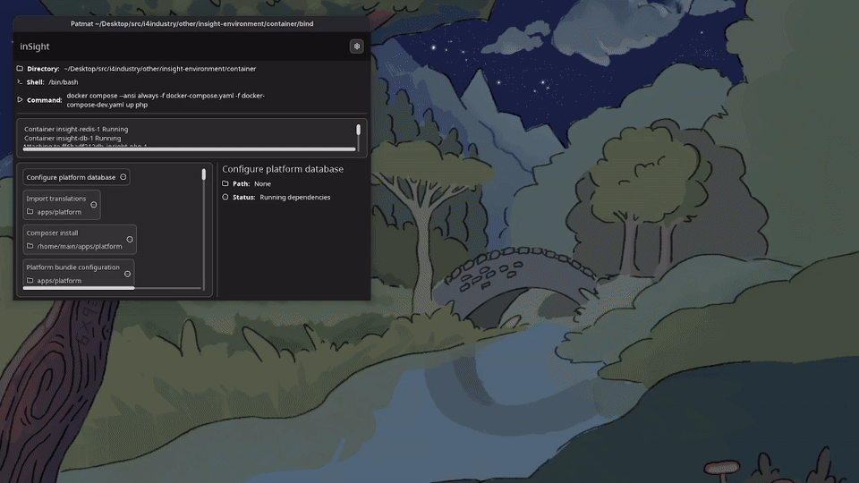

# PatMat

PatMat is a build tool whose recipes are meant to be written with the ease of a Makefile but with the flexibility of a script

## Features

- **Target dependency graph**: Targets declare prerequisites and run asynchronously in dependency order.
- **Built-in tasks**: Git clone, branch checkout, pull, filesystem operations, and embedded terminal commands.
- **Live GUI status**: Displays target hierarchy, active state, task output, and error traces in real time.
- **YAML configurator**: Generates interactive form menus for editing YAML configurations.

## Architecture

- **Targets and Tasks**: A `Target` defines an execution node with dependencies and an associated `Task_trait`.
- **Reactive UI**: The `Builder` widget renders the dependency tree, selection details, and active widgets via Drevo stores.
- **Terminal Task**: Runs commands with live terminal output embedded in the UI panel.

## Usage

Create a `Task` from a `Task_trait`, `Task::from_fn`, or `Task::from_run`. Built-in tasks cover clone, checkout, pull, filesystem operations, terminal commands, and prerequisite checks.

Wrap a task in `Target::new_independent(name, task)` or `Target::new(name, task, dependencies)`. `Target::get()` runs dependencies first, runs the target once, and returns its cached output on later calls.

Pass a non-empty `Dependencies` list and its working directory to `patmat::new()`. It returns a Drevo `Builder`, starts target execution in the background, and displays target status, output widgets, and errors.

The `drevo-configurator` crate provides `Configurator<Tree>` for interactive YAML configuration. A `Tree` supplies a `Configuration_tree_branch` and creates the serialized configuration when submitted.

## Demo

## Technologies used

- [drevo](https://github.com/ElectricPulse/drevo) for UI components and reactive layout
- [gix](https://github.com/GitoxideLabs/gitoxide) for Git operations
- [tokio](https://github.com/tokio-rs/tokio) for asynchronous runtime
